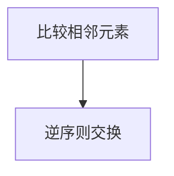

## 本质
相邻元素逆序就交换，每轮把最大值移到末尾。

## 命题
- P1. 每轮从头比较相邻元素，逆序则交换。

## 图

```mermaid
graph TD
  A[比较相邻元素] --> B[逆序则交换]
```

## 代码
```python
## not a heading inside a code block
for i in range(n):
    pass
```

## 相关
- [[选择排序]] — contrasts_with（交换次数）
